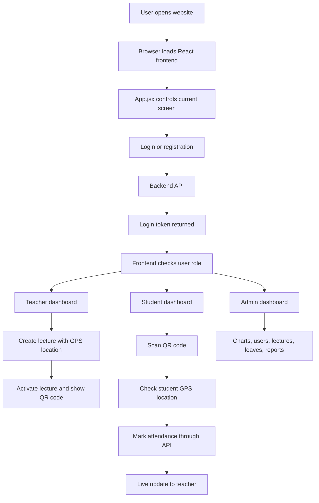
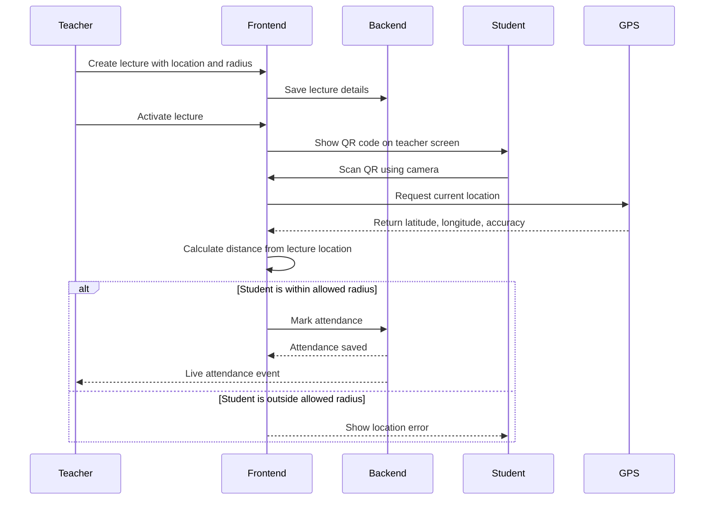

# Smart Attendance System Frontend Report

Project folder: `mit-attendance`

## 1. Simple Explanation

This project is a smart attendance system for MIT Art, Design and Technology University. In simple words, it replaces the normal paper attendance register with a digital system.

The system has three main users:

1. Students
2. Teachers or faculty
3. Admin users

A teacher creates a lecture. The system creates a QR code for that lecture. A student scans that QR code using the camera. Before marking attendance, the system checks the student's location using GPS. If the student is inside the allowed classroom area, attendance is marked.

The system also has student registration, face capture during registration, leave requests, attendance reports, charts, admin user management, PDF reports, Excel reports, CSV downloads, and a deployable frontend application.

Important note: this repository mainly contains the frontend, which means the visible part of the application that runs in the browser. The backend server and database are connected through API calls, but their source code is not present in this folder.

## 2. Purpose of the Project

The project is made to solve common attendance problems:

- Manual attendance takes time.
- Students can mark attendance for others if there is no verification.
- Teachers need quick reports.
- Admins need one place to monitor lectures, students, teachers, leaves, and attendance records.
- Institutions need attendance percentage and defaulter tracking.

This system tries to solve these problems using QR code scanning, GPS geofencing, live updates, reporting, analytics, and role-based dashboards.

## 3. Main Features

- Student, teacher, and admin login.
- Student and teacher registration.
- Student face capture during registration.
- Teacher lecture creation.
- GPS location setup for lecture location.
- Geofence radius selection for classroom or campus range.
- QR code based attendance marking.
- Student camera based QR scanner.
- GPS distance checking before attendance is accepted.
- Live attendance update for teachers using Socket.IO.
- Manual attendance correction by teachers.
- Leave request submission by students.
- Leave approval or rejection by teachers.
- Admin dashboard with statistics and charts.
- User management for admin.
- CSV, Excel, and PDF report downloads.
- Progressive Web App support.
- Docker and Nginx based production deployment support.
- Vercel deployment support.
- GitHub Actions CI build pipeline.

## 4. Project Type

This is a frontend web application.

Frontend means the part of the software that the user sees and interacts with. Buttons, forms, dashboards, QR scanner screens, reports, charts, and pages are all part of the frontend.

The backend is separate. The frontend talks to the backend through HTTP API calls. The configured backend URL is:

```text
https://attendence-backend-tfw2.onrender.com/api
```

The project also supports changing this URL using:

```text
VITE_API_URL
```

## 5. High Level Architecture

The application is built as a single page React application. A single page application means the browser loads one main HTML page, and React changes the screen internally without loading a new page from the server every time.



## 6. Folder and File Structure

```text
mit-attendance/
  src/
    App.jsx
    main.jsx
    index.css
    components/
      FaceCapture.jsx
      Icons.jsx
      InputField.jsx
      LocationPicker.jsx
      Modal.jsx
      Navbar.jsx
    pages/
      AdminPages.jsx
      AuthPages.jsx
      LandingPage.jsx
      StudentPages.jsx
      TeacherPages.jsx
    utils/
      geolocation.js
  public/
    models/
    MIT logo and image assets
  package.json
  vite.config.js
  tailwind.config.js
  Dockerfile
  nginx.conf
  vercel.json
  .github/workflows/frontend-ci.yml
```

Important files:

- `src/main.jsx`: starts the React application.
- `src/App.jsx`: main controller of the application. It decides which screen to show.
- `src/pages/AuthPages.jsx`: login and registration pages.
- `src/pages/TeacherPages.jsx`: teacher dashboard, lecture creation, live attendance, reports, leave approvals.
- `src/pages/StudentPages.jsx`: student dashboard, QR scanner, leave request, timetable, profile.
- `src/pages/AdminPages.jsx`: admin dashboard, charts, users, lectures, attendance, leave records.
- `src/components/FaceCapture.jsx`: camera and face descriptor capture using face-api.js.
- `src/components/LocationPicker.jsx`: teacher classroom location setup.
- `src/utils/geolocation.js`: GPS and distance calculation logic.
- `src/index.css`: main styling, animations, colors, layout classes.
- `vite.config.js`: Vite, PWA, build optimization, and caching setup.
- `Dockerfile` and `nginx.conf`: production container deployment setup.
- `vercel.json`: Vercel rewrite and frontend routing setup.

## 7. Application Startup Workflow

When the application starts:

1. `index.html` loads the root element.
2. `src/main.jsx` starts React using `createRoot`.
3. `main.jsx` wraps the app inside an error boundary.
4. `App.jsx` becomes the main brain of the frontend.
5. `App.jsx` checks if a login token and user are already saved in `sessionStorage`.
6. If a user is already logged in, the app fetches role-specific data.
7. If no user is logged in, the landing page is shown.

The app also sends a health request to the backend:

```text
GET /health
```

This keeps the hosted backend awake, which is useful because free hosting services can sleep when inactive.

## 8. Role Based Workflow

### 8.1 Student Workflow

Student flow:

1. Student opens the website.
2. Student logs in or registers.
3. During registration, the student captures their face.
4. After login, the student dashboard shows:
   - attendance percentage
   - classes attended
   - missed classes
   - recent attendance
   - leave requests
   - timetable
5. Student clicks mark attendance.
6. Camera opens and scans the lecture QR code.
7. The QR code contains a lecture ID.
8. The system gets the student's current GPS location.
9. The system calculates distance between student and lecture location.
10. If the student is inside the allowed radius, attendance is marked.
11. If outside the classroom zone, attendance is rejected.

Student related API calls:

```text
GET  /student/lectures
GET  /student/attendance/:studentId
POST /student/mark-attendance
GET  /student/leaves/:studentId
POST /student/leaves
GET  /student/profile/:studentId
PUT  /student/profile/:studentId
```

### 8.2 Teacher Workflow

Teacher flow:

1. Teacher logs in.
2. Teacher dashboard loads lecture list, student list, and attendance data.
3. Teacher creates a lecture by entering:
   - lecture name
   - subject code
   - date
   - time
   - classroom GPS location
   - allowed geofence radius
4. Teacher activates the lecture.
5. A QR code is displayed for students.
6. Students scan the QR and mark attendance.
7. Teacher dashboard receives live attendance updates.
8. Teacher can download lecture reports.
9. Teacher can manually correct attendance if needed.
10. Teacher can approve or reject leave requests.
11. Teacher can create cumulative and monthly reports.
12. Teacher can identify students below 75 percent attendance and send alerts.

Teacher related API calls:

```text
GET  /teacher/lectures/:teacherId
GET  /teacher/all-students
GET  /teacher/all-attendance
POST /teacher/lectures
GET  /teacher/lectures/:lectureId/attendance
GET  /teacher/lecture-report/:lectureId
POST /teacher/lectures/:lectureId/manual-attendance
GET  /teacher/leaves
PUT  /teacher/leaves/:leaveId
GET  /teacher/reports/defaulters/:teacherId
POST /teacher/reports/send-alerts/:teacherId
GET  /teacher/reports/cumulative/:teacherId
GET  /teacher/reports/monthly/:teacherId
```

### 8.3 Admin Workflow

Admin flow:

1. Admin logs in.
2. Admin dashboard loads institution-level data.
3. Admin can see:
   - total students
   - total teachers
   - total lectures
   - attendance record count
   - attendance trend charts
   - subject statistics
   - top performing students
   - all users
   - all lectures
   - all attendance records
   - leave requests
4. Admin can add, edit, delete, and export users.
5. Admin can download CSV files for data.

Admin related API calls:

```text
GET    /admin/dashboard-stats
GET    /admin/all-users
GET    /admin/combined-lectures
GET    /admin/combined-attendance
GET    /admin/attendance-trend
GET    /admin/top-students
GET    /admin/attendance-by-subject
GET    /admin/leaves
POST   /admin/users
PUT    /admin/users/:userId
DELETE /admin/users/:userId
```

## 9. Attendance Marking Architecture

Attendance is the most important workflow in the project.



The system uses two checks before marking attendance:

1. QR code check: confirms which lecture the student is trying to attend.
2. GPS geofence check: confirms whether the student is physically near the lecture location.

## 10. GPS and Geofencing Explanation

GPS means Global Positioning System. It tells the browser the user's approximate location using latitude and longitude.

Latitude means north-south position on Earth.

Longitude means east-west position on Earth.

Geofencing means drawing an invisible boundary around a real location. In this project, the teacher sets the classroom location and selects a radius such as 100 meters. If the student is inside that circle, attendance is allowed.

The distance is calculated using the Haversine formula. This formula calculates the distance between two points on Earth using latitude and longitude.

The code is in:

```text
src/utils/geolocation.js
```

The system also considers GPS accuracy. If the device location accuracy is poor, the app gives some tolerance:

```text
distance - min(accuracy, 200) <= lecture radius
```

This means the project tries to avoid wrongly rejecting students when laptop or mobile GPS is slightly inaccurate.

## 11. Face Capture Workflow

The student registration page includes face registration.

The file responsible is:

```text
src/components/FaceCapture.jsx
```

How it works:

1. The browser loads face recognition models from `public/models`.
2. If local models fail, it tries loading models from a CDN.
3. The browser asks permission to use the camera.
4. The student aligns their face.
5. face-api.js detects one face.
6. It finds facial landmarks.
7. It creates a face descriptor.
8. The descriptor is converted into a normal array.
9. The descriptor is stored in the registration form as `face_embedding`.
10. The backend receives this value during registration.

Important note: in the current frontend, face capture is used during student registration. The attendance scanning screen uses QR plus GPS. The frontend does not currently perform face matching during attendance. If face verification is required during attendance, the backend or frontend would need an additional comparison step.

## 12. Reporting Workflow

The project supports different types of reports:

- Single lecture CSV report.
- Manual attendance table.
- Cumulative attendance register.
- Monthly attendance register.
- PDF report.
- Excel report.
- Admin CSV exports.

Report libraries used:

- `jspdf`: creates PDF files in the browser.
- `jspdf-autotable`: creates tables inside PDF files.
- `xlsx`: creates Excel files.
- Browser `Blob`: creates CSV files.

Teacher reports include:

- lecture-wise attendance
- present or absent status
- total present count
- total lectures
- percentage
- below 75 percent defaulter list

Admin reports include:

- user list
- lecture list
- attendance list
- leave request list

## 13. Live Attendance Workflow

The teacher dashboard uses Socket.IO.

Socket.IO is used when the frontend needs live updates without refreshing the page. In this project, when a student marks attendance, the teacher can see the update live.

The frontend connects to:

```text
API_URL without /api
```

Then it joins a teacher room:

```text
join_teacher_room
```

It listens for:

```text
attendance_marked
```

When that event arrives, the frontend fetches updated attendance for the active lecture.

## 14. Authentication and Session Handling

Authentication means checking who the user is.

In this project:

1. User enters email and password.
2. Frontend sends login request to backend.
3. Backend returns user details and token.
4. Frontend saves token in `sessionStorage`.
5. Frontend sends token in future API requests using:

```text
Authorization: Bearer <token>
```

The token is used to prove that the user is logged in.

`sessionStorage` means browser storage that lasts until the browser tab or session is closed.

`localStorage` is also used, but only for saving the theme:

```text
theme = dark or light
```

## 15. Technologies Used

### 15.1 React

React is the main frontend library. It helps build the user interface using small reusable pieces called components.

Examples of components in this project:

- Navbar
- InputField
- FaceCapture
- LocationPicker
- TeacherDashboard
- StudentDashboard
- AdminDashboard

React is useful here because the screen changes depending on state:

- logged in or logged out
- student or teacher or admin
- active lecture or no active lecture
- loading or loaded
- modal open or closed

### 15.2 React Hooks

Hooks are React functions used inside components.

Important hooks used:

- `useState`: stores changing values.
- `useEffect`: runs code when the page loads or when a value changes.
- `useMemo`: avoids recalculating filtered admin users again and again.
- `useRef`: keeps a reference to the camera video element.

Example:

`useState` stores the current user, current view, lectures, attendance records, token, loading status, and dark mode.

### 15.3 Vite

Vite is the build tool. It starts the development server and creates the production build.

Commands:

```text
npm run dev
npm run build
npm run preview
```

Vite is faster than older tools because it uses modern browser module loading during development.

### 15.4 JSX

JSX is a syntax used by React. It lets developers write HTML-like UI code inside JavaScript files.

For example, dashboard cards, buttons, forms, and tables are written using JSX.

### 15.5 Tailwind CSS

Tailwind CSS is used for styling through utility classes.

Example classes:

```text
flex
grid
rounded-2xl
text-slate-500
bg-white
shadow-xl
```

The project also uses a custom CSS file with institutional colors, animations, buttons, cards, tables, and layout classes.

Main colors:

```text
MIT purple: #4B1D6F
MIT orange: #F39200
```

### 15.6 CSS Variables

CSS variables store reusable design values.

Example:

```text
--p: #4B1D6F
--o: #F39200
--bg: #f8f7ff
```

This makes it easier to keep a consistent design across the full application.

### 15.7 face-api.js

face-api.js is used for face detection and recognition in the browser.

It loads machine learning model files from:

```text
public/models
```

Models used:

- SSD MobileNet model: detects faces.
- 68 point landmark model: finds important face points like eyes, nose, and mouth.
- Face recognition model: creates a face descriptor.

A face descriptor is a numerical representation of a person's face. It is not a photo. It is a list of numbers that can later be compared with another face descriptor.

### 15.8 html5-qrcode

html5-qrcode opens the camera and reads QR codes in the browser.

In this project, the QR code contains a URL with:

```text
lectureId
```

The scanner extracts the lecture ID and starts the location verification process.

### 15.9 QR Code Generation

The teacher screen generates a QR image using an external QR generation URL:

```text
https://api.qrserver.com/v1/create-qr-code/
```

The QR data is the active lecture URL.

### 15.10 Browser Geolocation API

The Browser Geolocation API asks the device for current location.

The project uses:

```text
navigator.geolocation.watchPosition
```

It watches the position for a few seconds and chooses the best accuracy result.

### 15.11 Socket.IO Client

Socket.IO client is used for live teacher updates.

Normal API calls are like asking, "Is anything new?"

Socket.IO is like the server saying, "Something new happened" immediately.

This is useful for live attendance count.

### 15.12 Chart.js and react-chartjs-2

Chart.js creates charts.

react-chartjs-2 connects Chart.js with React.

The admin dashboard uses charts for:

- attendance trend
- subject attendance statistics

### 15.13 jsPDF and jspdf-autotable

jsPDF creates PDF files directly in the browser.

jspdf-autotable adds table support to PDFs.

These are used for attendance reports.

### 15.14 xlsx

xlsx creates Excel files.

Teachers can download attendance registers as `.xlsx` files.

### 15.15 Progressive Web App

The project uses `vite-plugin-pwa`.

A Progressive Web App can behave more like a mobile app:

- it can have a manifest
- it can cache files
- it can work better on poor networks
- it can be installed on some devices

The service worker caching is configured in `vite.config.js`.

### 15.16 Workbox

Workbox is used internally by the PWA setup. It manages caching rules and background sync.

This project configures:

- API caching using NetworkFirst
- attendance POST request background sync using NetworkOnly with a queue

NetworkFirst means the app first tries the internet. If the internet fails, it may use cached data.

Background sync means if a request fails due to network problems, the browser may retry later.

### 15.17 Browser Notification API

The frontend asks students for notification permission. If permission is granted, the app can show a notification when attendance is open.

### 15.18 REST API

REST API means the frontend talks to the backend through URLs and HTTP methods.

Common HTTP methods:

- GET: read data.
- POST: create data.
- PUT: update data.
- DELETE: remove data.

This project uses REST APIs for login, registration, lectures, attendance, leaves, reports, and admin data.

### 15.19 Bearer Token

Bearer token is a login proof sent with API requests.

Example:

```text
Authorization: Bearer token_here
```

The frontend receives the token from the backend and attaches it to protected requests.

### 15.20 Docker

Docker is used to package the frontend into a container.

The Dockerfile has three stages:

1. Install dependencies.
2. Build the React app.
3. Serve the built files using Nginx.

This makes deployment easier because the application runs the same way on any server that supports Docker.

### 15.21 Nginx

Nginx serves the final production files.

It also handles single page app routing using:

```text
try_files $uri $uri/ /index.html
```

This means if the user refreshes a frontend route, Nginx still serves the React app correctly.

### 15.22 Vercel

Vercel deployment is configured using `vercel.json`.

It rewrites:

- frontend routes to `index.html`
- `/api` requests to the hosted backend

### 15.23 GitHub Actions

GitHub Actions is used for CI/CD.

CI/CD means continuous integration and continuous deployment. In simple terms, when code is pushed, GitHub can automatically install dependencies, check linting, build the project, and upload build files.

The workflow file is:

```text
.github/workflows/frontend-ci.yml
```

### 15.24 ESLint

ESLint checks code quality. It finds unused variables, hook dependency problems, and other JavaScript issues.

The current latest lint output shows warnings in `StudentPages.jsx` related to hook dependencies. Earlier lint output had more issues, so some cleanup appears to have already been done.

## 16. How the Project Was Made

The project appears to have been built in these stages:

1. A React frontend was created using Vite.
2. Pages were separated by role: auth pages, landing page, student pages, teacher pages, and admin pages.
3. Reusable components were created for navbar, inputs, icons, modals, location picker, and face capture.
4. Styling was added using Tailwind CSS and custom CSS.
5. Authentication was connected to backend APIs.
6. Role-based dashboards were created.
7. Teacher lecture creation was added.
8. GPS based location picker was added for lecture geofencing.
9. QR scanning was added for student attendance.
10. Attendance marking was connected to backend APIs.
11. Live attendance updates were added using Socket.IO.
12. Leave management was added for students and teachers.
13. Admin dashboard was added with analytics and user management.
14. Reports were added using CSV, Excel, and PDF generation libraries.
15. Face registration was added using face-api.js.
16. PWA support was added using vite-plugin-pwa.
17. Docker, Nginx, Vercel, and GitHub Actions deployment support were added.

## 17. Data Stored in Browser

The frontend stores small data in browser storage.

`sessionStorage`:

- login token
- user object
- pending lecture ID

`localStorage`:

- light or dark theme preference

The actual main data such as users, lectures, attendance records, leave requests, and reports comes from the backend API.

## 18. Security and Reliability Notes

This section is useful for explaining project limitations honestly.

1. The frontend depends on a separate backend server. This repository does not include backend or database code.
2. Login token is stored in `sessionStorage`. This is common for frontend projects, but secure backend validation is still required.
3. GPS location can be inaccurate, especially on laptops. The project handles this by taking multiple readings and using the best one.
4. QR code attendance is protected by GPS geofencing, but stronger security could also include face verification during attendance.
5. Face capture exists during registration, but face matching during attendance is not implemented in the current frontend.
6. QR code generation uses an external QR image service. If that service is unavailable, QR display may fail.
7. Some image and model resources depend on internet fallback if local loading fails.
8. There is no dedicated automated test suite in the current project.
9. Current lint output shows two warnings in `StudentPages.jsx`.
10. Backend API security, database schema, email sending, and admin rules cannot be fully verified from this frontend-only repository.

## 19. Strengths of the Project

- Clear role-based workflow.
- Practical attendance flow using QR and GPS.
- Live teacher dashboard updates.
- Student leave management.
- Admin analytics dashboard.
- Multiple report export formats.
- Face registration support.
- PWA support for better user experience.
- Production deployment support through Docker, Nginx, Vercel, and GitHub Actions.
- Reusable React components.
- Clean separation between pages and components.

## 20. Possible Future Improvements

- Add face verification during attendance, not only during registration.
- Add unit tests and integration tests.
- Add better error pages for network failures.
- Add offline-first attendance queue visibility.
- Add role-specific route protection using a routing library.
- Add stronger QR expiry handling on backend.
- Add audit logs for manual attendance changes.
- Add direct admin approval or rejection for leaves if required.
- Replace external QR image service with local QR generation package.
- Improve lint warnings and remove old duplicate model files with zero size if unused.

## 21. Glossary of Technical Terms

### Frontend

The frontend is the visible part of the application. It includes screens, buttons, forms, tables, dashboards, QR scanner, and reports. This project is mainly a frontend project.

### Backend

The backend is the server-side part. It stores data, checks login, validates tokens, saves attendance, sends reports, and talks to the database. The backend is used by this project, but its code is not inside this folder.

### API

API means Application Programming Interface. It is a way for frontend and backend to talk. For example, when the frontend calls `/student/mark-attendance`, it is asking the backend to save attendance.

### REST API

REST API is a common style of API where actions are performed using URLs and HTTP methods such as GET, POST, PUT, and DELETE.

### Component

A component is a reusable piece of UI in React. For example, `InputField` is used in many forms instead of writing input code again and again.

### State

State means data that can change while the app is running. Example: current user, current page, selected lecture, loading status, and attendance records.

### Props

Props are values passed from one React component to another. For example, `TeacherDashboard` receives `user`, `lectures`, `token`, and `setView` as props.

### Hook

A hook is a special React function. `useState` stores data. `useEffect` runs code after rendering or when something changes.

### JSX

JSX is HTML-like code written inside JavaScript. React uses JSX to describe what should appear on the screen.

### Token

A token is a secret login proof. After login, the backend gives a token. The frontend sends it with future requests to prove the user is logged in.

### Bearer Token

Bearer token is a way to send the login token in an API request header.

### Session Storage

Session storage is browser storage that is cleared when the browser session ends. This project stores the login token and user details there.

### Local Storage

Local storage is browser storage that remains even after closing the browser. This project stores the dark mode or light mode preference there.

### QR Code

A QR code is a square barcode. It can store text or a URL. In this project, it stores lecture information so students can scan it.

### Geolocation

Geolocation means finding the user's location through the browser using GPS, Wi-Fi, or device location services.

### Geofencing

Geofencing means creating an invisible circle around a real location. In this project, the circle is around the lecture location.

### Haversine Formula

The Haversine formula calculates distance between two latitude and longitude points on Earth. This is used to decide if a student is close enough to the classroom.

### Socket

A socket is a live connection between frontend and backend. It lets the server send updates instantly. This project uses it for live attendance updates.

### PWA

PWA means Progressive Web App. It allows a website to behave more like an app, with caching and install support.

### Service Worker

A service worker is a background script in the browser. It can cache files and retry failed network requests.

### Cache

Cache means saved data. It helps the app load faster and sometimes work better when the network is weak.

### Background Sync

Background sync means the browser can retry a failed request later when the internet returns.

### CDN

CDN means Content Delivery Network. It hosts files on fast public servers. This project uses CDN fallback for face model files and also loads external images and fonts.

### Build

Build means converting development code into optimized production files that can be hosted on a server.

### Deployment

Deployment means putting the application on the internet or a server so users can access it.

### Docker

Docker packages the application with everything needed to run it. It helps the same app run consistently on different machines.

### Nginx

Nginx is a web server. In this project, it serves the final built React files.

### CI/CD

CI/CD means automatic checking, building, and deployment process. GitHub Actions is used for this project.

### Linting

Linting means checking code for mistakes, unused variables, and style problems.

### Dependency

A dependency is an external package used by the project. For example, React, Vite, face-api.js, html5-qrcode, Chart.js, jsPDF, and xlsx are dependencies.

## 22. One Minute Viva Explanation

This project is a Smart Attendance System frontend built with React and Vite. It has student, teacher, and admin portals. Teachers can create lectures with GPS location and radius. When a lecture is activated, the system shows a QR code. Students scan the QR code with their camera, and before attendance is marked, the browser checks their GPS location. If the student is inside the allowed geofence, attendance is sent to the backend API. Teachers can see live attendance using Socket.IO and can download CSV, Excel, and PDF reports. Students can view attendance, timetable, profile, and apply for leave. Admins can view analytics, manage users, see lectures, attendance, and leaves. The project also includes face capture during student registration, PWA support, Docker deployment, Nginx serving, Vercel rewrites, and GitHub Actions CI.

## 23. Final Summary

This project is a complete frontend for a smart attendance management system. It combines React UI, API integration, QR scanning, GPS geofencing, face registration, live updates, analytics, reports, and deployment configuration. It is designed to make attendance faster, more secure, easier to monitor, and easier to report for students, teachers, and administrators.

